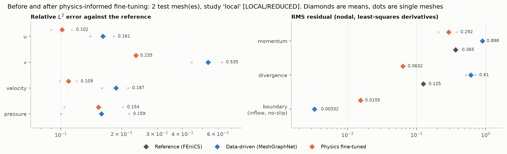
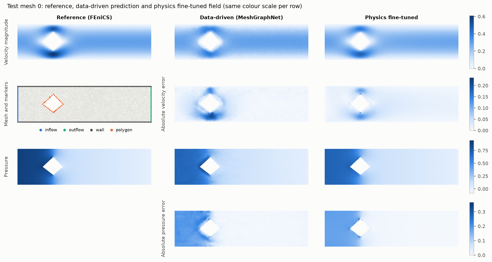
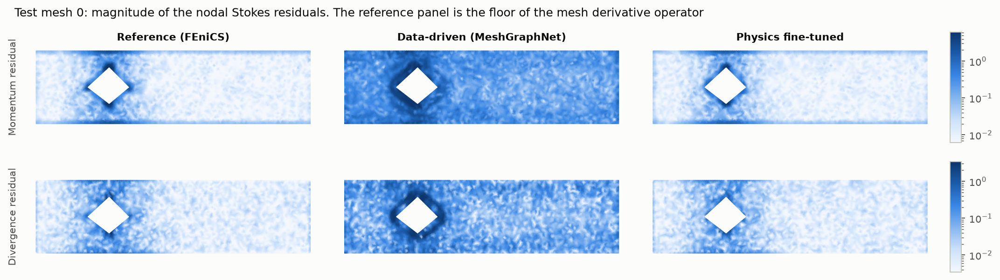
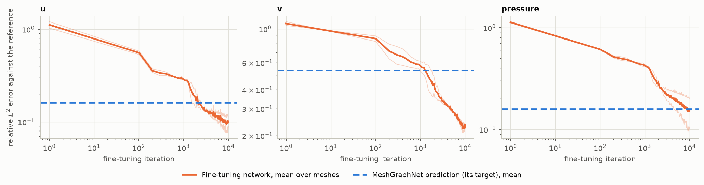

# Physics-informed fine-tuning of a Stokes-flow surrogate: a before/after study

A controlled comparison of the two stages of the NVIDIA PhysicsNeMo Stokes-flow example: a MeshGraphNet trained on finite-element data, and the physics-informed step that the example applies to its predictions afterwards. Both are evaluated on the same test meshes with the same metrics: prediction error against the finite-element reference, residuals of the Stokes equations, and boundary-condition residuals.

The model, the dataset pipeline, the Stokes residual and both training procedures are NVIDIA's ([`examples/cfd/stokes_mgn`](https://github.com/NVIDIA/physicsnemo/tree/b45a5c810c741e6b41f8515be24c51121f8fc21f/examples/cfd/stokes_mgn) at commit `b45a5c810c741e6b41f8515be24c51121f8fc21f`, PhysicsNeMo 2.3.0a0). This repository adds the controlled comparison, the evaluation, the checks of the residual formulation, and the reproducibility layer. See [Attribution](#attribution).

**Question.** Does physics-informed fine-tuning improve PDE consistency and predictive accuracy for the PhysicsNeMo Stokes-flow surrogate?

## Results

| Study | Configuration | Status |
|---|---|---|
| Residual formulation checks | `scripts/verify_physics.py`, 20 test meshes | VERIFIED |
| `smoke` | pipeline check, CPU | SMOKE (no numbers reported) |
| `local` | 100 training meshes, 40 epochs; fine-tuning as upstream | LOCAL/REDUCED, 2 of the 10 configured test meshes |
| `full` | NVIDIA settings (500 meshes, 500 epochs), 10 test meshes, CUDA | PENDING |
| `official` | NVIDIA settings, test mesh 7 only | NOT RUN (it is sample 7 of `full`) |

### Reduced local study

The only before/after numbers available so far come from `configs/local.yaml`: the MeshGraphNet saw 4,000 training iterations instead of the 250,000 of the NVIDIA configuration, so the data-driven baseline is weak, and the physics-informed stage (unchanged from upstream, 10,000 iterations) was completed on test meshes 0 and 1 only. The table is the mean over those two meshes; it does not describe the NVIDIA configuration. Source: [`results/local/summary.csv`](results/local/summary.csv).

| Metric | Reference floor | Data-driven | Physics fine-tuned | Change | Meshes improved |
|---|---:|---:|---:|---:|---:|
| Velocity relative $L^2$ error | | 0.188 | 0.109 | −41.8 % | 2/2 |
| $u$ relative $L^2$ error | | 0.161 | 0.102 | −37.1 % | 2/2 |
| $v$ relative $L^2$ error | | 0.535 | 0.235 | −56.0 % | 2/2 |
| Pressure relative $L^2$ error | | 0.159 | 0.154 | −3.3 % | 1/2 |
| Total $(u, v, p)$ relative $L^2$ error | | 0.175 | 0.145 | −16.7 % | 2/2 |
| Momentum residual, RMS | 0.365 | 0.898 | 0.292 | −67.5 % | 2/2 |
| Divergence residual, RMS | 0.125 | 0.610 | 0.063 | −89.6 % | 2/2 |
| Boundary residual (inlet and no-slip), RMS | $10^{-16}$ | 0.0033 | 0.0155 | +365 % | 0/2 |
| of which inlet | | 0.0063 | 0.0014 | −78.7 % | 2/2 |
| of which no-slip | | 0.0028 | 0.0163 | +478 % | 0/2 |
| Outlet pressure, RMS (not in the loss) | $5 \times 10^{-7}$ | 0.0062 | 0.0072 | +16.2 % | 1/2 |

Residuals are nodal, with least-squares mesh derivatives; "reference floor" is the same operator applied to the FEniCS solution on the same two meshes. The exact automatic-differentiation residual of the fine-tuned networks is 0.018 (momentum) and 0.011 (divergence).









What these two meshes show, for a weak data-driven baseline:

* **Velocity improves.** The velocity error falls on both meshes, most for the transverse component $v$, which the undertrained MeshGraphNet predicts worst. The fine-tuned field ends closer to the reference than the prediction it was fitted to: the PDE and boundary terms move it away from its data target in the right direction. The error was still decreasing after 10,000 iterations.
* **Pressure does not.** The pressure error is unchanged within the spread of two meshes (0.217 to 0.203 on mesh 0, 0.100 to 0.104 on mesh 1). The momentum equation constrains only $\nabla p$, and with no outlet term in the loss the pressure level is inherited from the MeshGraphNet prediction; the error map shows a nearly uniform offset upstream of the polygon in both fields.
* **PDE residuals drop to the resolution of the metric.** The nodal momentum residual falls from 2.5 times the reference floor to about the floor (0.21 and 0.38 against 0.39 and 0.34 on the two meshes), and the divergence residual to half its floor. Below the floor the metric cannot rank fields, so the supported statement is that the data-driven field is measurably less consistent with the Stokes equations than the reference, and the fine-tuned field is not.
* **No-slip gets worse.** The MeshGraphNet receives the boundary marker as an input and reproduces the wall values to 0.003; the coordinate network enforces them only through a penalty and ends at 0.016, about 5 % of the inlet velocity scale. The inlet profile, which has the same penalty weight on far fewer nodes, improves.

This is a trade: lower interior residuals and velocity error against a looser no-slip condition and an unchanged pressure. Whether it holds for a MeshGraphNet trained with the NVIDIA settings, where the data-driven error is expected to be much smaller and the room for improvement with it, is the open question of the pending `full` study.

### Compute

| | Data-driven stage | Physics-informed stage |
|---|---|---|
| Parameters | 2,531,587 | 49,923 per test mesh |
| Local study, Apple M3 Pro (MPS) | 2,308 s for 4,000 iterations | 1,690 s per mesh for 10,000 iterations (mean of 2) |
| Inference | 0.19 s per mesh | one optimisation per mesh; no reusable model |
| CUDA time and peak memory | PENDING | PENDING |

The local timings were taken while other jobs were using the same machine and are upper bounds, not benchmarks. At these rates the physics-informed step on one test mesh takes about three quarters of the time of the whole reduced MeshGraphNet training, and it has to be repeated for every new geometry.

## The Stokes problem

Steady incompressible Stokes flow in a channel $\Omega = [0, 1.5] \times [0, 0.4]$ obstructed by one random polygon:

$$-\nu \Delta \mathbf{u} + \nabla p = 0, \qquad \nabla \cdot \mathbf{u} = 0 \quad \text{in } \Omega,$$

with velocity $\mathbf{u} = (u, v)$, pressure $p$, kinematic viscosity $\nu = 0.01$ and no body force. The equations are used in dimensional form with these numerical values; no nondimensionalisation is applied.

| Boundary | Condition |
|---|---|
| Inlet $x = 0$ | parabolic profile $\mathbf{u} = \left(4 U y (0.4 - y) / 0.4^2,\ 0\right)$, $U = 0.3$ |
| Channel walls $y = 0$, $y = 0.4$ and polygon | no slip, $\mathbf{u} = 0$ |
| Outlet $x = 1.5$ | natural outflow condition $\nu\, \partial_n \mathbf{u} - p\, \mathbf{n} = 0$ |

The geometry changes from sample to sample through the polygon; the map to be learned is polygon geometry to $(u, v, p)$ on the mesh nodes.

### Dataset

*PhysicsNeMo Datasets: Stokes Flow* on NVIDIA NGC: 1000 FEniCS solutions, one triangle mesh each (3200 to 3450 nodes), stored as `.vtp` files with the nodal fields `u`, `v`, `p` and a boundary `marker` (0 interior, 1 inlet, 2 outlet, 3 wall, 4 polygon). The archive is 172 MB (222 MB unpacked) and is public for guest download. `scripts/prepare_data.py` downloads it, verifies its SHA-256 and writes the split; nothing under `data/` is tracked. The NGC entry describes it as a toy dataset for the example and its metadata carries no licence statement, so the data are not redistributed here.

The upstream `preprocess.py` shuffles the files without a seed and copies them 80/10/10. Here the same 80/10/10 partition is drawn with a fixed seed over the files in numeric order (800 training, 100 validation, 100 test) and recorded in `data/dataset/split.json`. As upstream, the first 500 training, 10 validation and 10 test files in numeric order are used. Inputs are not normalised; the targets $u, v, p$ and the edge features are standardised with training-set statistics.

## What the NVIDIA example does

The two stages are not a pretrain-then-continue schedule of one network. They are:

### Stage A: data-driven MeshGraphNet

`train.py` trains a [MeshGraphNet](https://arxiv.org/abs/2010.03409) on the mesh graph. Node inputs are the coordinates and the one-hot boundary marker (7 features), edge inputs the relative displacement and its length (3 features), outputs the standardised $(u, v, p)$. The network has an encoder, 15 message-passing blocks of width 128 with sum aggregation, and a decoder, with hidden width 256 in the encoder and decoder MLPs: 2,531,587 parameters. The objective is the mean squared error over the nodes,

$$\mathcal{L}_A(\theta) = \frac{1}{3N} \sum_{i=1}^{N} \left\| \hat{\mathbf{y}}_\theta(x_i) - \tilde{\mathbf{y}}_i \right\|^2, \qquad \tilde{\mathbf{y}} = \text{standardised } (u, v, p),$$

minimised with Adam, batch size 1, learning rate $10^{-4}$ decayed by a constant factor per epoch to $10^{-6}$ after 500 epochs of 500 meshes (250,000 iterations). `inference.py` then writes the prediction for each test mesh into a copy of its `.vtp` file.

### Stage B: physics-informed step

`pi_fine_tuning.py` takes **one test mesh** and the frozen MeshGraphNet prediction $(u_G, v_G, p_G)$ on it, and trains a **new** network from random initialisation: a coordinate MLP $(x, y) \mapsto (u, v, p)$ with 64 random Fourier features (frequencies drawn from $\mathcal{N}(0, 10^2)$, fixed), three hidden layers of width 128 with GELU, and 49,923 parameters, all trainable. No MeshGraphNet weight is loaded or updated. The objective is

$$\mathcal{L}_B(\phi) = \underbrace{\mathrm{mse}(u_\phi - u_G) + \mathrm{mse}(v_\phi - v_G) + \mathrm{mse}(p_\phi - p_G)}_{\text{match the MeshGraphNet prediction, all nodes}} + 10 \underbrace{\left[\mathrm{mse}_{\Gamma_{in}}(u_\phi - u_{in}) + \mathrm{mse}_{\Gamma_{in}}(v_\phi)\right]}_{\text{inlet profile}} + 10 \underbrace{\left[\mathrm{mse}_{\Gamma_{0}}(u_\phi) + \mathrm{mse}_{\Gamma_{0}}(v_\phi)\right]}_{\text{no slip}} + \underbrace{\mathrm{mse}(r_x) + \mathrm{mse}(r_y)}_{\text{momentum}} + 10 \underbrace{\mathrm{mse}(r_c)}_{\text{continuity}},$$

$$r_x = \partial_x p - \nu \Delta u, \qquad r_y = \partial_y p - \nu \Delta v, \qquad r_c = \partial_x u + \partial_y v,$$

where $\mathrm{mse}$ is the mean square over the mesh nodes (all nodes for the data and PDE terms, the inlet nodes $\Gamma_{in}$, the wall and polygon nodes $\Gamma_0$). Derivatives are exact, by automatic differentiation through PhysicsNeMo's `PhysicsInformer`. The optimiser is Adam with a constant learning rate $10^{-3}$ for 10,000 full-batch iterations. The result is written to the `.vtp` file as `filtered_u`, `filtered_v`, `filtered_p`; the upstream README calls it the filtered prediction.

Three properties of this step matter for reading the results:

* The data terms pull towards the MeshGraphNet prediction, not towards the reference. The reference solution never enters $\mathcal{L}_B$; the script only prints the error against it.
* The step is a per-mesh optimisation at inference time. It produces one small network per test mesh and does not change the surrogate.
* The outlet condition is not in the loss. With the data terms at weight 1, the pressure level is fixed only through $p_G$.

In this repository "data-driven" is the MeshGraphNet prediction (the checkpoint before the physics-informed step) and "physics fine-tuned" is the field of the coordinate network after it.

The example also ships `pi_fine_tuning_gnn.py`, which fits a new MeshGraphNet with Fourier node features on the same loss using least-squares mesh derivatives. The upstream README does not describe it and it is not run here; its derivative operator is used for evaluation (below).

### Differences between the upstream README and the upstream code

Found while reading the source at the pinned commit; the code and the data are what this repository follows.

| Upstream README | Upstream code and data |
|---|---|
| Outlet at $x = 2.2$ | All meshes span $x \in [0, 1.5]$ |
| Hidden dimensionality 256 in encoder, processor and decoder | The processor width is not passed and keeps the PhysicsNeMo default 128 |
| "The dataset is not publicly available" | `download_dataset.sh` fetches it from NGC without credentials |
| Outflow condition listed with the problem | No loss term for the outlet in either fine-tuning script |
| `mlp_hidden_dim: 256`, `mlp_num_layers: 6` in `config.yaml` | Not read; `pi_fine_tuning.py` hard-codes width 128 and three hidden layers |

## Evaluation

Every fine-tuned test mesh is evaluated from one `.vtp` file that holds the mesh, the reference, the MeshGraphNet prediction and the fine-tuned field, so both stages are compared on identical nodes (`src/stokes_ft/evaluate.py`).

| Group | Metric | Definition |
|---|---|---|
| Prediction | relative $L^2$ error of $u$, $v$, $p$, of the velocity vector, and of $(u, v, p)$ stacked | $\lVert a - a_{ref} \rVert_2 / \lVert a_{ref} \rVert_2$ over the nodes, physical units |
| Physics | momentum residual | RMS of $\sqrt{r_x^2 + r_y^2}$ over interior nodes |
| | divergence residual | RMS of $r_c$ over interior nodes |
| | boundary residual | RMS of $\lvert \mathbf{u} - \mathbf{u}_{bc} \rvert$ over inlet, wall and polygon nodes |
| | outlet pressure | RMS of $p$ over outlet nodes (the reference satisfies $p \approx 0$ there; no loss term enforces it) |
| Compute | parameters, training time, fine-tuning time, inference time, peak CUDA memory | timers synchronised with the device |

A graph network has no usable derivative with respect to position, so the residuals of nodal fields are computed on the mesh with PhysicsNeMo's weighted least-squares gradient (`grad_method="least_squares"`, applied twice for second derivatives), the operator of `pi_fine_tuning_gnn.py`. The same operator is applied to the reference, the MeshGraphNet prediction and the fine-tuned field. For the fine-tuned network the exact automatic-differentiation residual, the quantity it minimises, is reported as well.

### Checks of the residual formulation

`scripts/verify_physics.py` tests the formulation against the dataset, independently of the training code; the output is [`results/physics_checks.json`](results/physics_checks.json) (20 test meshes).

| Check | Result |
|---|---|
| Viscosity and sign of $\nabla p - \nu \Delta \mathbf{u} = 0$: least-squares fit of $\nu$ in the P1 Galerkin weak form of the reference fields, interior nodes farther than 0.03 from any boundary | $\nu = 0.01005$ (0.00996 to 0.01021); the code uses 0.01 |
| Inlet pressure gradient of the reference against the Poiseuille value $-8 \nu U / H^2 = -0.15$ | $-0.154$ ($-0.159$ to $-0.149$) |
| Reference boundary data: inlet profile with $U = 0.3$, no slip | satisfied to $10^{-16}$ |
| Reference outlet pressure | RMS $5 \times 10^{-7}$ |
| Automatic-differentiation residual on Poiseuille flow (an exact solution) | 0 for all three equations |
| Automatic-differentiation residual on a manufactured field against the analytic residual | maximum deviation $3 \times 10^{-7}$ |
| Least-squares operator on analytic fields, dataset mesh: Laplacian | relative error 11 % at interior nodes, 42 to 50 % at boundary nodes |
| Least-squares operator: residual of the **reference solution** | momentum 0.30 (0.15 to 0.56), divergence 0.10 (0.05 to 0.20) |

The equations, the sign convention, the viscosity factor and the inlet profile in the NVIDIA code agree with the data, and coordinates are used unnormalised in both stages, so no rescaling of derivatives is involved. No defect was found in the residual implementation.

The last two rows set the resolution of the nodal residual metrics. On these meshes ($h \approx 0.014$) the twice-applied least-squares gradient reproduces the Laplacian of smooth analytic fields only to about 11 % in the interior and worse next to boundaries, and the exact finite-element solution itself has a nodal momentum residual of about 0.30, concentrated at the polygon corners and the walls. A nodal residual near or below that floor does not show that a field is closer to a Stokes solution than the reference is; a smooth field can score below the floor.

## Reproduction

Python 3.11 to 3.14. PhysicsNeMo is pinned to the upstream commit and requires `torch>=2.13`.

```bash
python -m venv .venv && source .venv/bin/activate
pip install -r requirements.txt
# torch_scatter has no prebuilt wheel for torch>=2.13: build it against the installed torch
FORCE_ONLY_CPU=1 pip install --no-build-isolation --no-binary torch-scatter torch-scatter==2.1.2

python scripts/prepare_data.py                  # 172 MB download, SHA-256 check, seeded split
python -m pytest -q                             # 38 tests, no dataset needed
python scripts/verify_physics.py                # results/physics_checks.json
python scripts/run_study.py --config smoke      # pipeline check on the CPU, about a minute
python scripts/run_study.py --config local      # reduced study (Apple MPS); add --resume to continue it
python scripts/results.py publish runs/local    # copy the small result files to results/local
python scripts/plot_results.py --study results/local --out figures
```

`run_study.py` runs the stages `train`, `predict`, `finetune`, `evaluate` (select with `--stages`, continue an interrupted run with `--resume`); trailing arguments are Hydra overrides, for example `device=cuda`. `--evaluate-samples 0,1` evaluates a subset of the configured test meshes when the fine-tuning stage is incomplete, and the summary is then marked as partial. An unavailable device is an error, never a silent fallback.

### Configurations

| Config | Data-driven stage | Physics-informed stage | Purpose |
|---|---|---|---|
| `official` | 500 meshes, 500 epochs (upstream) | test mesh 7, 10,000 iterations (upstream) | NVIDIA's settings; the upstream keys and values, with added keys below a marker |
| `full` | as `official` | test meshes 0 to 9, 10,000 iterations each | single-GPU study; a 10-mesh mean instead of one mesh |
| `local` | 100 meshes, 40 epochs | as `full` | reduced study on a laptop; the MeshGraphNet is undertrained |
| `smoke` | 6 meshes, 2 epochs, encoder and decoder width 32 | 2 meshes, 20 iterations | pipeline check; its numbers are not results |

All four share the architecture code, the optimisers, the learning-rate rule, the loss weights, the split and the seed. `full` and `official` use the same seed for both stages, so the upstream case (test mesh 7) is one of the ten samples of `full`.

Changes to the upstream procedure, all in the reproducibility layer: a seed (upstream sets none), the seeded split, single-process training without Weights & Biases, a checkpoint every 25 epochs that stores the number of completed epochs with older ones removed (upstream writes one per epoch and keeps all), and per-mesh seeding and timing of the fine-tuning loop. Seeding fixes the initialisation and the sample order; scatter accumulation order is not fixed, so two runs agree to rounding and are not bit-for-bit identical.

### GPU run

`kaggle/run_cuda.ipynb` is a thin launcher: it checks out an exact 40-character commit, verifies `HEAD` and a clean tree, prints the GPU and software versions, downloads and verifies the dataset, runs the tests and a CUDA smoke study, and measures one training epoch and 200 fine-tuning iterations. From that probe it projects the runtime of `configs/full.yaml` and starts the full study only if `RUN_FULL = True` and the projection fits the stated session budget; otherwise it reports the numbers and changes nothing. It stores the MeshGraphNet checkpoint, the ten fine-tuning networks and the result files as archives. To integrate a finished run:

```bash
python scripts/results.py publish physicsnemo-stokes-finetuning-full.zip
python scripts/plot_results.py --study results/full --out figures
```

NVIDIA states no reference hardware or training time for this example; its README only notes that multi-GPU training with `mpirun` is supported.

## Repository layout

```text
configs/            official (upstream values), full, local, smoke
src/stokes_ft/      data.py  model.py  engine.py  finetune.py      adapted from the NVIDIA example
                    physics.py  metrics.py  evaluate.py  plotting.py  study.py  provenance.py  config.py
scripts/            prepare_data.py  run_study.py  verify_physics.py  plot_results.py  results.py
tests/              configuration, data, model, residuals, fine-tuning, pipeline, launcher
kaggle/             run_cuda.ipynb
results/            physics_checks.json and one directory per study (see results/README.md)
figures/            figures drawn from results/
```

Every study directory records the timestamp, repository commit and dirty state, PhysicsNeMo commit, seed, device and GPU, Python, PyTorch, PyTorch Geometric and torch_scatter versions, the resolved configuration, the dataset checksum and the simulation numbers used, and the timings of both stages. Checkpoints, datasets and `.vtp` outputs are not tracked.

## Limitations

* **The before/after comparison is reduced and partial.** It rests on two test meshes and a MeshGraphNet trained for 1.6 % of the upstream iterations on 100 meshes. Two samples give no meaningful spread. The study with NVIDIA's settings on ten test meshes requires a CUDA GPU and has not been run; `results/` holds no CUDA numbers.
* **One seed.** The fine-tuning network depends on its random Fourier matrix and initialisation; the sensitivity to that draw was not measured.
* **Nodal residuals have a floor.** The least-squares mesh operator assigns the exact reference a momentum residual of about 0.3. Residuals below that level are not evidence of better physics, and the automatic-differentiation residual exists for the coordinate network only, so the two stages cannot be compared with an exact operator.
* **The physics-informed step never sees the reference, and is not a surrogate.** It regularises one prediction on one mesh; its cost is a full optimisation per geometry. Its benefit is bounded by the information in the PDE, the two boundary terms and the MeshGraphNet prediction: the outlet condition and hence the pressure level are not constrained.
* **Upstream choices are kept as they are.** The loss weights, the 10,000 iterations, the constant learning rate and the soft boundary penalties are NVIDIA's; no tuning or sweep was done, and the second upstream variant (`pi_fine_tuning_gnn.py`) was not run.
* **Runs are seeded but not bit-for-bit reproducible**, and the pinned PhysicsNeMo commit is a development snapshot (2.3.0a0) of the main branch.
* **Dataset provenance.** The reference solver settings (element type, mesh generation) are not documented upstream beyond "FEniCS", and the NGC entry states no licence.

Possible extensions: the full CUDA study; several fine-tuning seeds; an outlet term in the loss to test the pressure explanation; hard enforcement of the wall condition; the mesh-based upstream variant, which keeps the boundary marker as an input.

## Attribution

Built on [NVIDIA PhysicsNeMo](https://github.com/NVIDIA/physicsnemo), Apache-2.0, at commit `b45a5c810c741e6b41f8515be24c51121f8fc21f` (version 2.3.0a0), example `examples/cfd/stokes_mgn`.

| File here | Adapted from | What is NVIDIA's | What was changed |
|---|---|---|---|
| `configs/official.yaml` | `conf/config.yaml` | all keys above the marker and their values | Hydra and path keys replaced; keys for seed, split, physics constants and evaluation added |
| `src/stokes_ft/model.py` | `train.py` | MeshGraphNet construction and arguments | made a function |
| `src/stokes_ft/engine.py` | `train.py`, `inference.py` | loss, optimiser, learning-rate schedule, training and validation loops, denormalisation, `.vtp` output | single process, seed, history file, checkpoint cadence, timing |
| `src/stokes_ft/finetune.py` | `pi_fine_tuning.py` | `Stokes` PDE, `DNN`, `FourierDNN` (unchanged), `PhysicsInformedFineTuner`: loss terms, weights, optimiser | logging call removed, device handling, inflow maximum and learning rate as arguments with the upstream defaults, driver function with seed, history and timing |
| `src/stokes_ft/data.py` | `preprocess.py`, `utils.py` | 80/10/10 split, `.vtp` reading | seeded split with a manifest, dictionary output |

`MeshGraphNet`, `StokesDataset`, `PhysicsInformer`, the automatic-differentiation and least-squares gradient modules and the checkpoint utilities are imported from the PhysicsNeMo package and are not copied. The architecture and the physics-informed step are NVIDIA's; MeshGraphNet is due to Pfaff et al. This repository contributes the evaluation code (`physics.py`, `metrics.py`, `evaluate.py`), the verification script, the study orchestration, the figures and the tests. Adapted files keep the NVIDIA copyright and licence header with a statement of the changes; see [`NOTICE`](NOTICE).

## References

* NVIDIA PhysicsNeMo, https://github.com/NVIDIA/physicsnemo
* T. Pfaff, M. Fortunato, A. Sanchez-Gonzalez, P. W. Battaglia, *Learning Mesh-Based Simulation with Graph Networks*, ICLR 2021, https://arxiv.org/abs/2010.03409
* M. Raissi, P. Perdikaris, G. E. Karniadakis, *Physics-informed neural networks*, Journal of Computational Physics 378 (2019)
* M. Tancik et al., *Fourier Features Let Networks Learn High Frequency Functions in Low Dimensional Domains*, NeurIPS 2020

## Licence

Apache-2.0, see [`LICENSE`](LICENSE) and [`NOTICE`](NOTICE).
